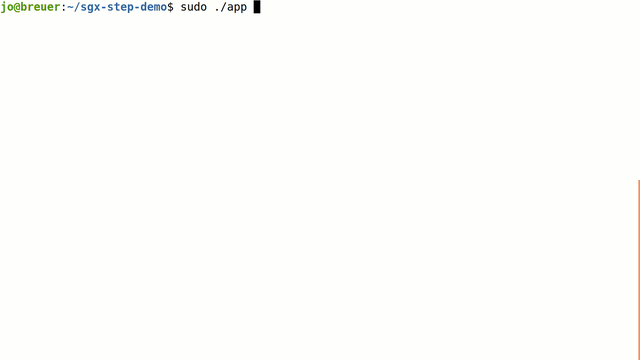
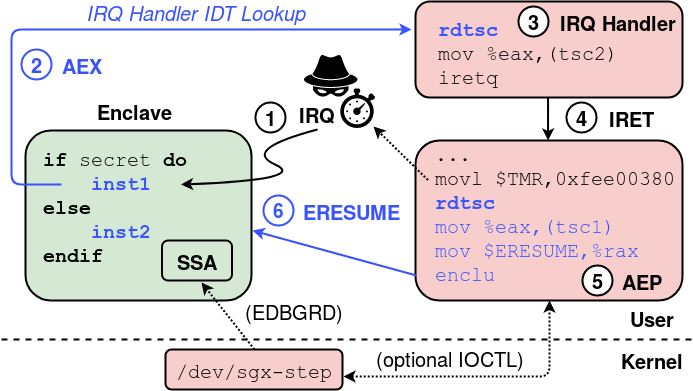
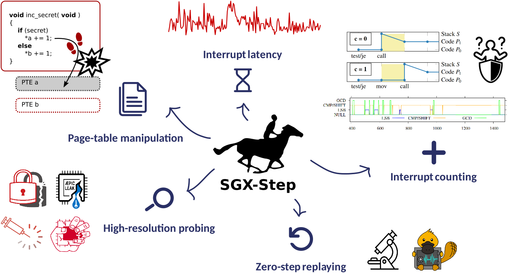
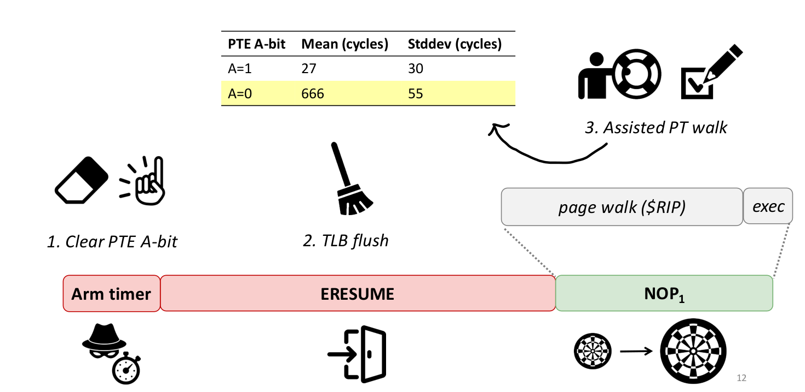

# A Practical Attack Framework for Precise Enclave Execution Control [](https://github.com/jovanbulck/sgx-step/actions/workflows/ci.yaml)


SGX-Step is an open-source framework to facilitate side-channel attack research
on Intel x86 processors in general and Intel SGX platforms in particular.
SGX-Step consists of an adversarial Linux kernel driver and a small user-space
operating system library that allows to configure untrusted page table entries
and/or x86 APIC timer interrupts completely from user space. SGX-Step has been
leveraged in our own research, as well as by independent researchers, to enable
several new and improved enclaved execution attacks that gather side-channel
observations at a maximal temporal resolution (i.e., by interrupting the victim
enclave after _every_ single instruction).

**License.** SGX-Step is free software, licensed under
[GPLv3](https://www.gnu.org/licenses/gpl-3.0). The SGX-Step logo is derived
from Eadweard Muybridge's iconic [public
domain](https://en.wikipedia.org/wiki/Sallie_Gardner_at_a_Gallop) "Sallie
Gardner at a Gallop" photo series, which, like our enclave single-stepping
goal, breaks down the galloping horse dynamics into a series of individual
photo frames to reveal overall horse gait properties.

| SGX-Step release | Changelog features                                                             |
| ---------------- | ------------------------------------------------------------------------------ |
| v1.5.0           | Stabilization fixes (KPTI, kernel ISR mapping); (experimental) Gramine port; IPI support. |
| v1.4.0           | Privileged interrupt/call gates (Plundervolt).                                 |
| v1.3.0           | Transient-execution support (Foreshadow).                                      |
| v1.2.0           | User-space interrupt handling and deterministic zero-step filtering (Nemesis). |
| v1.1.0           | IA32 support.                                                                  |
| v1.0.0           | User-space page table manipulation and APIC timer single-stepping.             |

**Publications.** SGX-Step has been employed by several independent research
groups and has enabled a new line of high-resolution SGX attacks. A full
up-to-date list of known projects using SGX-Step is included at the
[bottom](#bottom) of this README. A copy of the original paper is available
[here](https://jovanbulck.github.io/files/systex17-sgxstep.pdf).

```
@inproceedings{vanbulck2017sgxstep,
    title     = {{SGX-Step}: A Practical Attack Framework for Precise Enclave Execution Control},
    author    = {Van Bulck, Jo and Piessens, Frank and Strackx, Raoul},
    booktitle = {2nd Workshop on System Software for Trusted Execution {(SysTEX)}},
    publisher = {{ACM}},
    pages     = {4:1--4:6},
    month     = Oct,
    year      = 2017,
}
```

**Demo.** The [app/memcmp](app/memcmp) directory contains a small demo application that
illustrates the power of SGX-Step attacks by single-stepping a sample enclave
that contains subtle, non-constant-time `memcmp` password comparison logic.
As opposed to traditional, notoriously noisy timing attacks, SGX-Step can
deterministically brute-force the password character-per-character in _linear_
time:



## Overview

Crucial to the design of SGX-Step, as opposed to previous enclave preemption
proposals, is the creation of user-space virtual memory mappings for physical
memory locations holding page table entries, as well as for the local APIC
memory-mapped I/O configuration registers and the x86 Interrupt Descriptor
Table (IDT). This allows an untrusted, attacker-controlled host process to
easily (i) track or modify enclave page table entries, (ii) configure the APIC
timer one-shot/periodic interrupt source, (iii) trigger inter-processor
interrupts, and (iv) register custom interrupt handlers completely _within_
user space.



The above figure summarizes the sequence of hardware and software steps when
interrupting and resuming an SGX enclave through our framework.

1. The local APIC timer interrupt arrives within an enclaved instruction.
2. The processor executes the AEX procedure that securely stores execution
   context in the enclave’s SSA frame, initializes CPU registers, and vectors
   to the (user space) interrupt handler registered in the IDT.
3. At this point, any attack-specific, spy code can easily be plugged in.
4. The library returns to the user space AEP trampoline. We modified the
   untrusted runtime of the official SGX SDK to allow easy registration of a
   custom AEP stub. Furthermore, to enable precise evaluation of our approach on
   attacker-controlled benchmark debug enclaves, SGX-Step can _optionally_ be
   instrumented to retrieve the stored instruction pointer from the interrupted
   enclave's SSA frame (using Linux's `/proc/self/mem` interface and the
   `EDBGRD` instruction).
5. Thereafter, we configure the local APIC timer for the next interrupt
   by writing into the initial-count memory-mapped I/O register, just before
   executing (6) `ERESUME`.

## Source code overview

This repository is organized as follows:

```
.
├── app        -- Collection of sample client applications using SGX-Step to
│                 attack different victim enclave scenarios.
├── doc        -- Papers and reference material.
├── kernel     -- Minimal dynamically loadable Linux kernel driver to export
│                 physical memory to user space and bootstrap `libsgxstep`.
├── libsgxstep -- Small user-space operating system library that implements the
│                 actual SGX-Step functionality, including x86 page-table and
│                 APIC timer manipulations.
└── sdk        -- Bindings to use SGX-Step with different SGX SDKs and libOSs.
```

## Framework features and applications

SGX-Step is a universal execution control framework that enables the precise
interleaving of victim enclave instructions with _arbitrary_ attacker code.
Some of the main use cases of the SGX-Step framework are summarized in the
figure below (see also the [bottom](#bottom) of this README for an up-to-date
list of publications using SGX-Step).



## Building and running

### 0. System requirements

SGX-Step requires an [SGX-capable](https://github.com/ayeks/SGX-hardware) Intel
processor, and an off-the-shelf Linux kernel. Our original evaluation was performed on
i7-6500U/6700 CPUs, running Ubuntu 18.04 with a stock Linux 4.15.0 kernel.
More recent Linux kernels and distributions are also supported.
We summarize Linux [kernel parameters](https://www.kernel.org/doc/html/latest/admin-guide/kernel-parameters.html)
below.

| Linux kernel parameter               | Motivation                                                                                                                                                                     |
| ------------------------------------ | ------------------------------------------------------------------------------------------------------------------------------------------------------------------------------ |
| `nox2apic`                           | Configure local APIC device in memory-mapped I/O mode (to make use of SGX-Step's precise single-stepping features).                                                            |
| `iomem=relaxed no_timer_check`       | Suppress unneeded warning messages in the kernel logs.                                                                                                                         |
| `nmi_watchdog=0`                     | Suppress the kernel NMI watchdog.                                                                                                                                              |
| `isolcpus=1`                         | Affinitize the victim process to an isolated CPU core.                                                                                                                         |
| `clearcpuid=308,295,514`             | Disable supervisor mode access prevention (SMAP, bits 295), supervisor mode execution prevention (SMEP, bits 308) and user-mode instruction prevention (UMIP, bits 514) features. |
| `pti=off`                            | Disable Kernel Page-Table Isolation (to avoid kernel panics with user IRQ handlers).                                                                                           |
| `rcupdate.rcu_cpu_stall_suppress=1` | Disable the kernel's read-copy update (RCU) CPU stall detector (to avoid warnings when single-stepping for a long time without calling the kernel's timer interrupt handler.)  |
| `msr.allow_writes=on`                | Suppress kernel warning messages for model-specific register (MSR) writes by SGX-Step.                                                                                         |
| `vdso=0`                             | Only on recent Linux kernels: disable vdso_sgx_enter_enclave library (not compatible with AEP interception patches).                                                           |
| `dis_ucode_ldr`                      | Optionally disable CPU microcode updates (recent transient-execution attack mitigations may necessitate re-calibrating the single-stepping interval).                          |

Pass the desired boot parameters to the kernel as follows:

```bash
  # if you don't have vim, use nano instead
$ sudo vim /etc/default/grub
  # Add the following line: GRUB_CMDLINE_LINUX_DEFAULT="quiet splash nox2apic iomem=relaxed no_timer_check clearcpuid=308,295,514 pti=off isolcpus=1 nmi_watchdog=0 rcupdate.rcu_cpu_stall_suppress=1 msr.allow_writes=on vdso=0"

$ sudo update-grub && reboot
```

To check that the currently running kernel is configured correctly, execute:

```bash
$ sudo ./check_sys.sh
.. Checking recommended SGX-Step parameters          [OK]
.. Checking unknown kernel parameters                [OK]
.. Checking CPU features                             [OK]
.. Checking kernel page-table isolation              [OK]
```

Finally, to improve overall execution time stability, you may opt to
additionally disable C-States and SpeedStep technology in the BIOS
configuration.

### 1. Build and load `/dev/sgx-step`

SGX-Step comes with a loadable kernel module that exports an IOCTL interface to
the `libsgxstep` user-space library. The driver is mainly responsible for (i)
hooking the APIC timer interrupt handler, (ii) collecting untrusted page table
mappings, and optionally (iii) fetching the interrupted instruction pointer for
benchmark enclaves.

To build and load the `/dev/sgx-step` driver, execute:

```bash
$ cd kernel/
$ ./install_SGX_driver.sh              # tested on Ubuntu 18.04/20.04/22.04
$ make clean load
```

**Note (/dev/sgx_enclave).** SGX-Step supports both the legacy Intel
`/dev/isgx` out-of-tree driver that should work on all platforms, as well as
well as the upstream `/dev/sgx_enclave` driver for platforms with recent Linux
kernels >5.11 plus hardware support for flexible-launch control. The
`install_SGX_driver.sh` script should automatically detect whether an in-tree
`/dev/sgx_enclave` driver is available, and, if not, build and load the
out-of-tree `/dev/isgx` driver via the git submodule that points to an
unmodified v2.14 [linux-sgx-driver](https://github.com/intel/linux-sgx-driver).

**Note (/dev/mem).** We rely on Linux's virtual `/dev/mem` device to construct
user-level virtual memory mappings for APIC physical memory-mapped I/O
registers and page table entries of interest. Recent Linux distributions
typically enable the `CONFIG_STRICT_DEVMEM` option which prevents such use,
however. Our `/dev/sgx-step` driver therefore includes an
[approach](https://www.libcrack.so/index.php/2012/09/02/bypassing-devmem_is_allowed-with-kprobes/)
to bypass `devmem_is_allowed` checks, without having to recompile the kernel.

### 2. Patch and install SGX SDK

To enable easy registration of a custom Asynchronous Exit Pointer (AEP) stub,
we modified the untrusted runtime of the official Intel SGX SDK. Proceed as
follows to checkout [linux-sgx](https://github.com/01org/linux-sgx) v2.16 and
apply our patches.

```bash
$ cd sdk/intel-sdk/
$ ./install_SGX_SDK.sh                 # tested on Ubuntu 18.04/20.04
$ source /opt/intel/sgxsdk/environment # add to ~/.bashrc to preserve across terminal sessions
$ sudo service aesmd status            # stop/start aesmd service if needed
```

The above install scripts are tested on Ubuntu 18.04 LTS.
For other GNU/Linux distributions, please follow the instructions in the
[linux-sgx](https://github.com/01org/linux-sgx) project to build and install
the Intel SGX SDK and PSW packages. You will also need to build and load an
(unmodified) [linux-sgx-driver](https://github.com/01org/linux-sgx-driver) SGX
kernel module in order to use SGX-Step.

**Note (local installation).** The patched SGX SDK and PSW packages can be
installed locally, without affecting a compatible system-wide 'linux-sgx'
installation. For this, the example Makefiles support an `SGX_SDK`
environment variable that points to the local SDK installation directory. When
detecting a non-default SDK path (i.e., not `/opt/intel/sgxsdk`), the "run"
Makefile targets furthermore dynamically link against the patched
`libsgx_urts.so` untrusted runtime built in the local `linux-sgx` directory
(using the `LD_LIBRARY_PATH` environment variable).

**Note (32-bit support).** Instructions (outdated and not maintained!) for
building 32-bit versions of the SGX SDK and SGX-Step can be found in
[README-m32.md](README-m32.md).

### 3. Build and run test applications

User-space applications can link to the `libsgxstep` library to make use of
SGX-Step's single-stepping and page table manipulation features. Have a look at
the example applications in the "app" directory.


First, check the APIC and interrupt-descriptor table setup:

```bash
$ cd app/idt
$ make run    # fires interrupts in an infinite loop to stress-test stability; exit with CTRL-C
```

For example, to build and run an elementary example application to test page
table manipulation features and SDK patches:

```bash
$ cd app/aep-redirect
$ make run
```

To test timer single-stepping functionality, try for example building and
running the `strlen` attack from the paper for a benchmark enclave that
processes the secret string 100 repeated times:

```bash
$ cd app/bench
$ NUM=100 STRLEN=1 make parse   # alternatively vary NUM and use BENCH=1 or ZIGZAG=1
$ # (above command defaults to the Dell Inspiron 13 7359 evaluation laptop machine;
$ # use DESKTOP=1 to build for a Dell Optiplex 7040 machine)
$ # use SGX_SDK=/home/jo/sgxsdk/ for a local SDK installation
$ # use M32=1 To produce a 32-bit executable
```

The above command builds `libsgxstep`, the benchmark victim enclave, and the
untrusted attacker host process, where the attack scenario and instance size
are configured via the corresponding environment variables. The same command
also runs the resulting binary non-interactively (to ensure deterministic timer
intervals), and finally calls an attack-specific post-processing Python script
to parse the resulting enclave instruction pointer benchmark results.

**Note (performance).** Single-stepping enclaved execution incurs a substantial
slowdown. We measured execution times of up to 15 minutes for the experiments
described in the paper. SGX-Step's page table manipulation features allow to
initiate single-stepping for selected functions only, for instance by revoking
access rights on specific code or data pages of interest.

**Note (timer interval).** The exact timer interval value depends on CPU
frequency, and hence remains inherently platform-specific (see also
[app/apic](app/apic) for detailed microbenchmarks assessing the accuracy of
various APIC timer modes). Configure a suitable value in `/app/bench/main.c`.
We established precise timer intervals for our evaluation platforms (see table
below) by tweaking and observing the NOP microbenchmark enclave instruction
pointer trace results, as further outlined below.

**Note (stability).** In order to avoid the Linux kernel getting stuck or
panicking, SGX-Step should automatically restore the interrupt-descriptor table
and local APIC timer after exiting the `libsgxstep` process. You can check if
the APIC timer is still firing on all cores as follows:

```bash
$ watch -n0.1 "cat /proc/interrupts | grep 'Local timer interrupts'"
```

## Calibrating the single-stepping interval

The table below lists currently supported Intel CPUs, together with their
single-stepping APIC timer interval (`libsgxstep/config.h`).
Note that the exact single-stepping interval may depend on the microcode
version of the processor when recent [transient-execution attack](https://transient.fail/) mitigations are
in place to flush microarchitectural buffers on enclave entry/exit.
Some different microcode versions are provided for reference in the table below.

| Model name    | CPU                                                                                                                                  | Base frequency | ucode (date)      | APIC timer interval |
| ------------- | ------------------------------------------------------------------------------------------------------------------------------------ | -------------- | ----------------- | ------------------- |
| Skylake       | [i7-6700](https://ark.intel.com/products/88196)                                                                                      | 3.4 GHz        | ?                 | 19                  |
| Skylake       | [i7-6500U](https://ark.intel.com/products/88194)                                                                                     | 2.5 GHz        | ?                 | 25                  |
| Skylake       | [i5-6200U](https://ark.intel.com/products/88193)                                                                                     | 2.3 GHz        | ?                 | 28                  |
| Kaby Lake R   | [i7-8650U](https://ark.intel.com/products/124968)                                                                                    | 1.9 GHz        | ?                 | 34                  |
| Kaby Lake R   | [i7-8650U](https://ark.intel.com/products/124968)                                                                                    | 1.9 GHz        | 0xca (2019-10-03) | 54                  |
| Coffee Lake R | [i7-9700](https://ark.intel.com/content/www/us/en/ark/products/191792/intel-core-i79700-processor-12m-cache-up-to-4-70-ghz.html)     | 3 GHz          | 0xf4 (2022-07-31) | 26                  |
| Coffee Lake R | [i9-9900K](https://ark.intel.com/products/186605)                                                                                    | 3.6 GHz        | ?                 | 21                  |
| Ice Lake      | [i5-1035G1](https://ark.intel.com/content/www/us/en/ark/products/196603/intel-core-i5-1035g1-processor-6m-cache-up-to-3-60-ghz.html) | 1.00 GHz       | 0x32 (2019-07-05) | 135                 |
| Ice Lake      | [i5-1035G1](https://ark.intel.com/content/www/us/en/ark/products/196603/intel-core-i5-1035g1-processor-6m-cache-up-to-3-60-ghz.html) | 1.00 GHz       | 0xb0 (2022-03-09) | 255                 |

**Note (calibration).**
Currently, the easiest way to configure a reliable timer interval is to
use the `app/bench` benchmarking tool with a long NOP slide and
gradually increase/decrease `SGX_STEP_TIMER_INTERVAL`. You can probably
start around 20 and then execute `NUM=100 make parse` to get a summary
of single-steps, zero-steps, and multi-steps for a NOP slide of 100
instructions (once you have a more or less stable interval you can
switch to longer slides). Too many zero-steps indicate that you have to
increase the timer interval, whereas multi-steps demand lowering the
timer interval.

**Note (filtering out zero-steps).**
Important: do not worry when there are some zero-steps left, as
long as you make progress, you can always deterministically filter out
zero-steps by looking at the enclave's code PTE accessed bit (which is
only set when the instruction actually retires and a single-step occured).
Thus, after configuring a conservative timer interval that always precludes
multi-steps, SGX-Step can achieve noiseless single-stepping at a _perfect_,
instruction-level granularity.

**Note (extending the interrupt "landing window").** 
As clarified in the root-cause analysis below, the slower the page table walk
to resolve the (code) address of the first enclave instruction following
`ERESUME`, the longer the interrupt "landing window" and, hence, the more
reliable SGX-Step's single-stepping rate will be.  For instance, we found that,
on top of clearing the enclave's PMD accessed bit, the landing window can be
even further extended by flushing one or more of the unprotected page-table
entries from the CPU cache before `ERESUME`, effectively forcing the CPU to
wait for slow memory during the page-table walk. Thus, when you cannot find a
reliable timer-interval configuration, make sure to (i) clear the enclave's
code PTE/PMD "accessed" bit and (ii) flush (`CLFLUSH`) one or more enclave
page-table entries in the AEP handler.

**Note (microcode).**
Another word of caution relates to recent Foreshadow/ZombieLoad/RIDL/etc
microcode mitigations that flush leaky uarch buffers on enclave
entry/exit. Be aware that when these mitigations are enabled, the timer
interval will have to be increased as enclave entry takes longer (e.g.,
on my i7-8650U CPU I found the single-step timer interval goes up to 54
with recent ucode, from only 34 with pre-Foreshadow ucode).
The additional flushing operations may furthermore somewhat increase the
variance of enclave entry time, which implies that you might have to
configure the timer more conservatively with more zero-steps (which can be
deterministically filtered out as explained above).

### SGX-Step root-cause analysis

A detailed root-cause analysis of how exactly SGX-Step
succeeds in reliably interrupting the first (possibly very short!) enclave
instruction following the notoriously complex `ERESUME` instruction is described in the
[AEX-Notify](https://jovanbulck.github.io/files/usenix23-aexnotify.pdf) paper.
We found that the key to SGX-Step's success lies in its use of the "accessed"
(A) bit. Specifically, SGX-Step always clears the A-bit in the victim en
clave's page-middle directory (PMD) before arming the APIC to fire a one-shot
interrupt. The A-bit is only ever set by the processor when at least one
instruction is executed by the enclave and can, hence, be used to
deterministically distinguish between zero-steps versus single-steps.



Crucially, as the processor's page-miss handler is optimized for the common
fast path and uses a much slower "microcode assist" to handle the less frequent
and more complex case where a PMD or PTE needs to be modified, this assist has
the effect of prolonging the execution of the first enclave instruction
following `ERSUME` by several hundreds of cycles. This "assist window" thus
effectively opens a spacious landing space for the coarse-grained, normally
distributed APIC timer interrupt to arrive with high accuracy.

## Using SGX-Step in your own projects

The easiest way to get started using the SGX-Step framwork in your own
projects, is through [git
submodules](https://git-scm.com/book/en/v2/Git-Tools-Submodules):

```bash
$ cd my/git/project
$ git submodule add https://github.com/jovanbulck/sgx-step.git
$ cd sgx-step # Now build `/dev/sgx-step` and `libsgxstep` as described above
```

Have a look at the Makefiles in the `app` directory to see how a client
application can link to `libsgxstep` plus any local SGX SDK/PSW packages.

<a name="bottom"></a>
The following is a list of known projects that use SGX-Step. Feel free to open
a pull request if your project uses SGX-Step but is not included below.

| Title                                                                                          | Publication details                                                                          | Source code                                                               | SGX-Step features used                                  |
| ---------------------------------------------------------------------------------------------- | -------------------------------------------------------------------------------------------- | ------------------------------------------------------------------------- | ------------------------------------------------------- |
| AEX-Notify: Thwarting Precise Single-Stepping Attacks through Interrupt Awareness for Intel SGX Enclaves | [USEC23](https://jovanbulck.github.io/files/usenix23-aexnotify.pdf) | [GitHub (SGX SDK mitigation)](https://github.com/intel/linux-sgx/blob/master/sdk/trts/linux/trts_mitigation.S) | Single-Stepping, PTE A/D
| BunnyHop: Exploiting the Instruction Prefetcher | [USEC23](https://www.usenix.org/system/files/usenixsecurity23-zhang-zhiyuan-bunnyhop.pdf) | [GitHub (non-SGX PoC)](https://github.com/0xADE1A1DE/BunnyHop) | Single-stepping, PTE A/D |
| Downfall: Exploiting Speculative Data Gathering | [USEC23](https://www.usenix.org/system/files/usenixsecurity23-moghimi.pdf) | [GitHub (non-SGX PoC)](https://github.com/flowyroll/downfall/tree/main/POC) | Single-stepping, zero-stepping |
| All Your PC Are Belong to Us: Exploiting Non-control-Transfer Instruction BTB Updates for Dynamic PC Extraction | [ISCA23](https://dl.acm.org/doi/pdf/10.1145/3579371.3589100?casa_token=Q5jf5nOgiLIAAAAA:cT0ltJh7vk943buODuR4oMFKmuhg2Tp-djFm2kUu6DzlxtBhNhEw2WteRggn0k99D7ft-P6pluVrFA) | - | Single-stepping |
| Cache-timing attack against HQC                                                                | [CHES23](https://eprint.iacr.org/2023/102.pdf)                                               | -                                                                         | Single-stepping, PTE A/D                                |
| FaultMorse: An automated controlled-channel attack via longest recurring sequence              | [ComSec23](https://www.sciencedirect.com/science/article/pii/S0167404822003959)              | [GitHub (post processing)](https://github.com/Ezekiel-1998/FaultMorse)                        | Page fault                                              |
| On (the Lack of) Code Confidentiality in Trusted Execution Environments                        | [arXiv22](https://arxiv.org/pdf/2212.07899.pdf)                                              | -                                                                         | Single-stepping                                         |
| AEPIC Leak: Architecturally Leaking Uninitialized Data from the Microarchitecture              | [USEC22](https://www.usenix.org/system/files/sec22-borrello.pdf)                             | [GitHub (full)](https://github.com/IAIK/AEPIC)                                     | Single-Stepping, PTE A/D                                |
| MoLE: Mitigation of Side-channel Attacks against SGX via Dynamic Data Location Escape          | [ACSAC22](https://dl.acm.org/doi/fullHtml/10.1145/3564625.3568002)                           | -                                                                         | Single-Stepping, page fault, transient execution        |
| WIP: Interrupt Attack on TEE-Protected Robotic Vehicles                                        | [AutoSec22](https://www.ndss-symposium.org/wp-content/uploads/autosec2022_23001_paper.pdf)      | -                                                                         | Single-stepping, multi-stepping                         |
| Towards Self-monitoring Enclaves: Side-Channel Detection Using Performance Counters            | [NordSec22](https://link.springer.com/chapter/10.1007/978-3-031-22295-5_7)                   | -                                                                         | Page fault, LVI.                                        |
| ENCLYZER: Automated Analysis of Transient Data Leaks on Intel SGX                              | [SEED22](https://ieeexplore.ieee.org/document/9935016)                                       | [GitHub (full)](https://github.com/bloaryth/enclyser)                              | Page-table manipulation                                 |
| Side-Channeling the Kalyna Key Expansion                                                       | [CT-RSA22](https://cs.adelaide.edu.au/~yval/pdfs/ChuengsatiansupGYZ22.pdf)                   | -                                                                         | Single-Stepping, PTE A/D                                |
| Rapid Prototyping for Microarchitectural Attacks                                               | [USENIX22](https://www.usenix.org/system/files/sec22summer_easdon.pdf)                       | [GitHub (full)](https://github.com/libtea/frameworks)                              | Single-stepping, page fault, PTE A/D, etc.              |
| Util::Lookup: Exploiting Key Decoding in Cryptographic Libraries                               | [CCS21](https://dl.acm.org/doi/abs/10.1145/3460120.3484783)                                  | [GitHub (full)](https://github.com/UzL-ITS/util-lookup)                            | Single-Stepping, PTE A/D                                |
| SmashEx: Smashing SGX Enclaves Using Exceptions                                                | [CCS21](https://dl.acm.org/doi/pdf/10.1145/3460120.3484821)                                  | -                                                                         | Single-Stepping                                         |
| Online Template Attacks: Revisited                                                             | [CHES21](https://tches.iacr.org/index.php/TCHES/article/view/8967/8545)                      | [Zenodo (simulation)](https://zenodo.org/record/4680071)                                 | Single-stepping, page fault, PTE A/D                    |
| Aion Attacks: Manipulating Software Timers in Trusted Execution Environment                    | [DIMVA21](http://individual.utoronto.ca/shengjiexu/publication/whuang-dimva2021-aion_v2.pdf) | -                                                                         | Single-stepping, interrupts(?)                          |
| Platypus: Software-based Power Side-Channel Attacks on x86                                     | [S&P21](https://platypusattack.com/platypus.pdf)                                             | [GitHub (simulated PoC)](https://github.com/0xhilbert/Platypus)                             | Single-stepping, zero-stepping                          |
| CrossTalk: Speculative Data Leaks Across Cores Are Real                                        | [S&P21](https://download.vusec.net/papers/crosstalk_sp21.pdf)                                | -                                                                         | Single-stepping, page fault                             |
| Frontal Attack: Leaking Control-Flow in SGX via the CPU Frontend                               | [USEC21](https://www.usenix.org/system/files/sec21-puddu.pdf)                                | [GitHub (full, artifact evaluated)](https://github.com/dn0sar/frontal_poc)                             | Single-stepping interrupt latency, PTE A/D              |
| PThammer: Cross-User-Kernel-Boundary Rowhammer through Implicit Accesses | - | [MICRO20](https://arxiv.org/pdf/2007.08707v2.pdf) | Page table walk |
| SpeechMiner: A Framework for Investigating andMeasuring Speculative Execution Vulnerabilities  | [NDSS20](https://www.ndss-symposium.org/wp-content/uploads/2020/02/23105-paper.pdf)          | [GitHub (full)](https://github.com/teecert/SpeechMiner)                            | Page-table manipulation                                 |
| Déjà Vu: Side-Channel Analysis of Mozilla's NSS | [CCS20](https://dl.acm.org/doi/pdf/10.1145/3372297.3421761) | - | Page fault  |
| From A to Z: Projective coordinates leakage in the wild                                        | [CHES20](https://eprint.iacr.org/2020/432.pdf)                                               | -                                                                         | Page fault                                              |
| LVI: Hijacking Transient Execution through Microarchitectural Load Value Injection             | [S&P20](https://lviattack.eu/lvi.pdf)                                                        | [GitHub (PoC)](https://github.com/jovanbulck/sgx-step-lvi/tree/master/app/lvi)    | Single-stepping, page-table manipulation                |
| CopyCat: Controlled Instruction-Level Attacks on Enclaves                                      | [USEC20](https://arxiv.org/pdf/2002.08437.pdf)                                               | -                                                                         | Single-stepping, page fault, PTE A/D                    |
| When one vulnerable primitive turns viral: Novel single-trace attacks on ECDSA and RSA         | [CHES20](https://eprint.iacr.org/2020/055.pdf)                                               | -                                                                         | Single-stepping, page fault, PTE A/D                    |
| Big Numbers - Big Troubles: Systematically Analyzing Nonce Leakage in (EC)DSA Implementations  | [USEC20](https://www.usenix.org/system/files/sec20summer_weiser_prepub_0.pdf)                | -                                                                         | Page fault                                              |
| Plundervolt: Software-based Fault Injection Attacks against Intel SGX                          | [S&P20](https://plundervolt.com/doc/plundervolt.pdf)                                         | [GitHub (full)](https://github.com/KitMurdock/plundervolt)                         | Privileged interrupt/call gates, MSR                    |
| Bluethunder: A 2-level Directional Predictor Based Side-Channel Attack against SGX             | [CHES20](https://heartever.github.io/files/bluethunder_sgx_ches.pdf)                         | -                                                                         | Single-stepping                                         |
| Fallout: Leaking Data on Meltdown-resistant CPUs                                               | [CCS19](https://mdsattacks.com/files/fallout.pdf)                                            | -                                                                         | PTE A/D                                                 |
| A Tale of Two Worlds: Assessing the Vulnerability of Enclave Shielding Runtimes                | [CCS19](https://people.cs.kuleuven.be/~jo.vanbulck/ccs19-tale.pdf)                           | [GitHub (full)](https://github.com/jovanbulck/0xbadc0de)                           | Single-stepping, page fault, PTE A/D                    |
| ZombieLoad: Cross-Privilege-Boundary Data Sampling                                             | [CCS19](https://zombieloadattack.com/zombieload.pdf)                                         | [GitHub (PoC)](https://github.com/IAIK/ZombieLoad/)                               | Single-stepping, zero-stepping, page-table manipulation |
| SPOILER: Speculative Load Hazards Boost Rowhammer and Cache Attacks                            | [USEC19](https://arxiv.org/pdf/1903.00446.pdf)                                               | -                                                                         | Single-stepping interrupt latency                       |
| Nemesis: Studying Microarchitectural Timing Leaks in Rudimentary CPU Interrupt Logic           | [CCS18](https://people.cs.kuleuven.be/~jo.vanbulck/ccs18.pdf)                                | [GitHub (full)](https://github.com/jovanbulck/nemesis)                             | Single-stepping interrupt latency, page fault, PTE A/D  |
| Foreshadow: Extracting the Keys to the Intel SGX Kingdom with Transient Out-of-Order Execution | [USEC18](https://foreshadowattack.eu/foreshadow.pdf)                                         | [GitHub (PoC)](https://github.com/jovanbulck/sgx-step/tree/master/app/foreshadow) | Single-stepping, zero-stepping, page-table manipulation |
| Single Trace Attack Against RSA Key Generation in Intel SGX SSL                                | [AsiaCCS18](https://rspreitzer.github.io/publications/proc/asiaccs-2018-paper-1.pdf)         | -                                                                         | Page fault                                              |
| Off-Limits: Abusing Legacy x86 Memory Segmentation to Spy on Enclaved Execution                | [ESSoS18](https://people.cs.kuleuven.be/~jo.vanbulck/essos18.pdf)                            | [link (full, artifact evaluated)](https://distrinet.cs.kuleuven.be/software/off-limits/)             | Single-stepping, IA32 segmentation, page fault          |
| SGX-Step: A Practical Attack Framework for Precise Enclave Execution Control                   | [SysTEX17](https://people.cs.kuleuven.be/~jo.vanbulck/systex17.pdf)                          | [GitHub (full)](https://github.com/jovanbulck/sgx-step/tree/master/app/bench)      | Single-stepping, page fault, PTE A/D                    |
