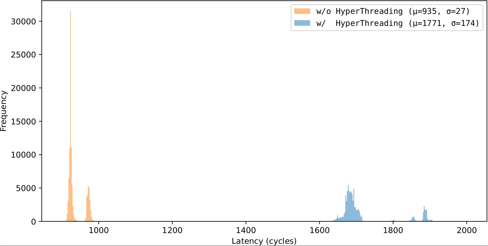
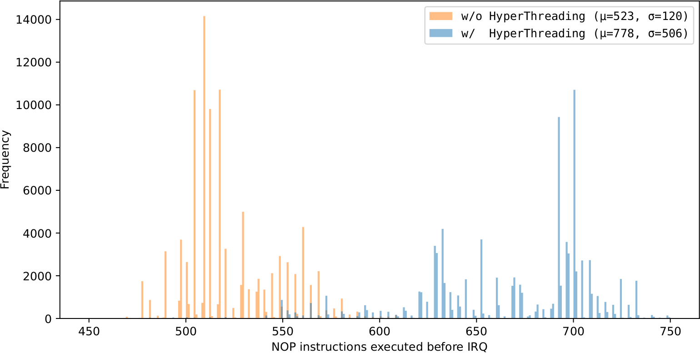

# APIC Precision Microbenchmarks

This directory contains the experiments to determine the accuracy of inter-processor
interrupts (IPIs) sent through the local APIC, as described in Appendix A of the
[AEX-Notify paper](https://jovanbulck.github.io/files/usenix23-aexnotify.pdf).
See [../apic](../apic) for complementary microbenchmarks that assess
the accuracy of APIC timer interrupts.

**Experimental setup.** IPIs are similarly sent and received via the local APIC
bus and can be triggered by merely writing to memory-mapped APIC registers.  We
measure the elapsed cycles between triggering an IPI from a spy CPU and
execution of our custom interrupt handler on the victim CPU. In our setup, we
first synchronize spy and victim threads, before triggering the IPI in the spy
thread and executing a lengthy NOP instruction slide in the victim thread.

