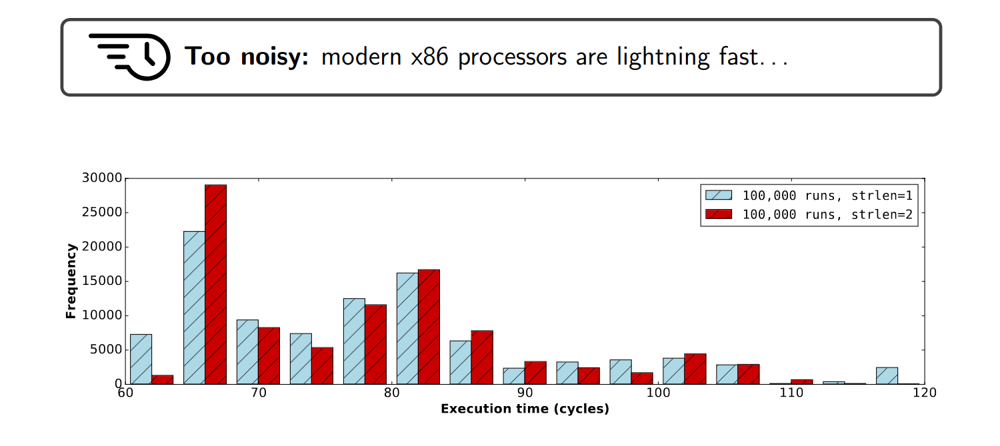

# SGX-Step demo: Building a determinstic `memcmp()` password oracle

This directory contains a small demo application that illustrates the power of
SGX-Step attacks by single-stepping a sample enclave that contains subtle,
non-constant-time `memcmp` password comparison logic.

## Description of the vulnerability

The vulnerable enclave function is shown below:

```C
int my_memcmp(char *a, int a_len, char *b, int b_len)
{
    int i;

    /* first check overall len */
    if (a_len != b_len)
        return 0;

    /* now check individual chars */
    for (i=0; i < a_len; i++)
    {
        if (a[i] != b[i])
            return 0;
    }
    return 1;
}
```

This non-constant-time function is called to compare the attacker-provided
password guess with the secret, in-enclave password. The main idea of the
exploit is to accurately detect the early-out `return 0` cases in the
conditional control-flow above to learn which _individual_ password byte was
wrong. This allows to brute-force the password in linear (instead of
exponential) time one password byte at a time, as illustrated below:


## Example exploit

The demo shows that by merely counting the number of instructions executed on
the `memcmp` page per password guess, the password can be trivially
brute-forced character-per-character in linear time.


This clearly shows the substantial advantage of an interrupt-driven SGX-Step
adversary, as opposed to traditional start-to-end timing attacks, which are
notoriously noisy and would need _many_ repetitions to establish the subtle,
single-instruction control-flow differences exploited in this example, e.g., as
experimentally illustrated below:



## Real-world counterpart

This example is loosely based on the real-world CVE-2018-3626
([paper](https://jovanbulck.github.io/files/ccs19-tale.pdf);
[source code](https://github.com/jovanbulck/0xbadc0de/tree/master/intel-sgx-sdk/sgx-strlen))
that similarly exploited a non-constant-time `strlen` computation to build a
deterministic zero-byte oracle with SGX-Step.

