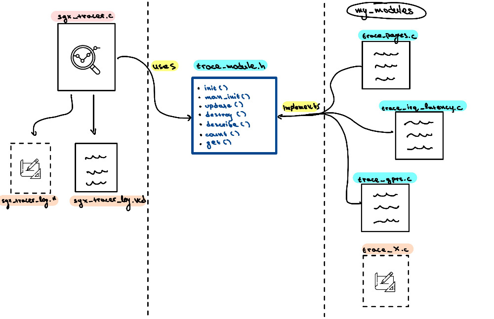
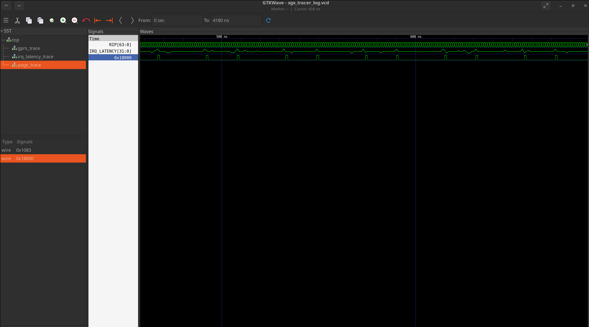

# SGX Tracer

A modular tracing framework for SGX enclave execution built on top of sgx-step. It allows fine-grained, per-step recording of enclave state including memory page access patterns, general purpose registers, and interrupt behavior.
Recorded data can be exported to the [Value Change Dump (VCD)](https://en.wikipedia.org/wiki/Value_change_dump) format for visualization in waveform viewers such as [GTKWave](http://gtkwave.sourceforge.net/).

---



---
## Modules

| Module | Enum | Description |
|--------|------|-------------|
| Page Tracker | `PAGES` | Tracks access bit of specified enclave pages at each step |
| GPR Tracker | `GPRS` | Records general purpose register values from the SSA GPRSGX region |
| IRQ Tracker | `IRQ` | Records interrupt firing and timing information |

### Note
The `GPRS` capabilities of the tracer should only be used in *debug* enclaves and *not* production ones.

---

## API
### Initialization
To initialize the tracer use the following command:
```c
void sgx_tracer_init(sgx_tracer_t *t);
```
---
### Enabling Modules
#### Track everything for a set of modules
```c
// Example of tracer options
//track_type_t tracer_options[] = {
//    PAGES
//    GPRS
//};

void sgx_tracer_trace_all(sgx_tracer_t *t, const track_type_t *options, size_t opt_cnt);
```

Enables the given modules and tracks all available items (all pages, all registers).

#### Track a specific module with specific items
```c
void sgx_tracer_man_add(sgx_tracer_t *t, track_type_t opt, void *items, size_t num_of_items);
```
Enables a module but only tracks the specified items. Pass `NULL` for modules that do not require items (e.g. `IRQ`).

#### Enable a single module (all items)
```c
void sgx_tracer_enable(sgx_tracer_t *t, track_type_t opt);
```
---
### Per-Step Update
```c
void sgx_tracer_update(sgx_tracer_t *t);
```

Call this inside your SGX-Step interrupt handler to record the current state of all enabled modules. Each call advances the internal time step.
For the tracer to work properly this function call must be called when (with the help of sgx-step) a single step has been confidently performed.
This should be called within the user-defined AEP callback function.

---
### Exporting to VCD
```c
void sgx_tracer_vcd(sgx_tracer_t *t);
```

Writes all recorded data to `sgx_tracer_log.vcd` in the current directory. 
Open with GTKWave to visualize signal changes over time.

---
### Cleanup
```c
void sgx_tracer_destroy(sgx_tracer_t *t);
```

Frees all module state and allocated resources.

---

## Example Usage
### Track all GPRs + specific pages + IRQ
```c
sgx_tracer_t tracer;
sgx_tracer_init(&tracer);

/* Track all general purpose registers */
track_type_t tracer_options[] = { GPRS };
sgx_tracer_trace_all(&tracer, tracer_options, /*num_of_modules=*/1);

/* Track only specific enclave pages */
void *pages[] = {code_adrs, trigger_adrs};
sgx_tracer_man_add(&tracer, /*option=*/PAGES, pages, /*num_of_pages=*/2);

/* Track IRQ (no items required) */
sgx_tracer_man_add(&tracer, /*option=*/IRQ, NULL, /*number_doesnt_matter=*/0);
```

### Track only a specific register

```c
sgx_tracer_t tracer;
sgx_tracer_init(&tracer);

enum gprsgx_offset regs[] = { RIP };
sgx_tracer_man_add(&tracer, /*option=*/GPRS, regs, /*num_of_regs=*/1);
```

### Inside the SGX-Step IRQ handler
```c
void aep_cb_func(void)
{
    sgx_tracer_update(&tracer);
}
```

### Export and cleanup
```c
sgx_tracer_vcd(&tracer);
sgx_tracer_destroy(&tracer);
```

---

## VCD Output
The generated `sgx_tracer_log.vcd` file can be opened with GTKWave:

```bash
gtkwave sgx_tracer_log.vcd
```

Signals are grouped by module. Each time step corresponds to one SGX-Step interrupt fired during enclave execution.

---

## GTKWave Visualization

